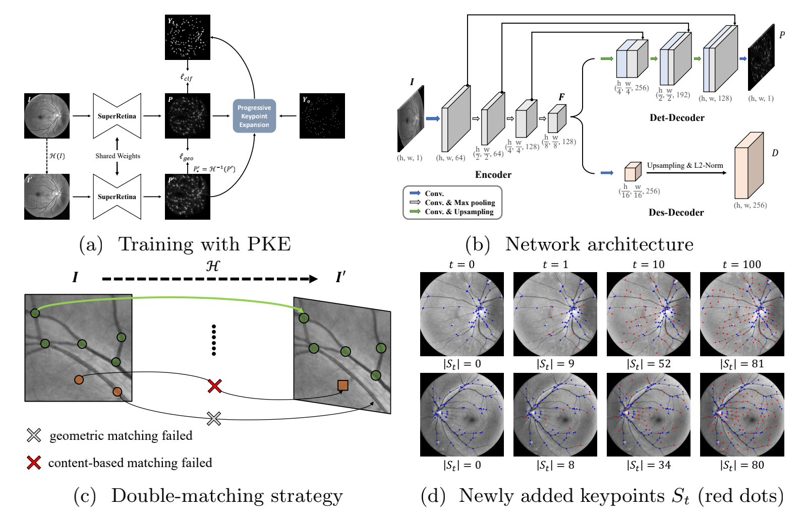

# 激光散斑眼底视频帧图像配准系统

本项目面向激光散斑眼底视频帧序列，实现了从图像质量筛选、基准帧选择、深度特征配准、效果评价到可视化导出的完整流程。配准核心基于 SuperRetina 关键点检测与描述子模型，项目在此基础上增加了批量视频帧处理、PyQt5 图形界面、NCC/DSC 评价、棋盘格可视化和配准前后对比视频生成等功能。



## 主要功能

- 图像质量过滤：剔除全黑、过曝、模糊等无效帧。
- 基准帧选择：根据中心与周边区域的熵、梯度信息自动选择质量较高的参考帧。
- 图像配准：使用 SuperRetina 提取眼底图像关键点与描述子，并通过特征匹配估计单应性矩阵。
- 批量处理：将有效帧统一配准到基准帧，并保存匹配信息。
- 效果评价：输出配准前后的 NCC、DSC 指标 CSV 和统计文本。
- 可视化：生成棋盘格对比图、血管掩码结果和配准前后对比视频。
- GUI 操作：提供一键配准、评价、视频生成和导出目录打开功能。

## 环境配置

建议使用 Python 3.8，并优先在 Conda 环境中运行。

```bash
conda create -n retina_registration python=3.8 -y
conda activate retina_registration
pip install -r requirements.txt
pip install PyQt5 scikit-image
```

说明：

- `PyQt5` 用于运行图形界面 `app.py`。
- `scikit-image` 用于可选的 SSIM 指标；未安装时程序会自动跳过。
- 预训练模型默认路径为 `save/SuperRetina.pth`，对应配置位于 `config/test.yaml`。

## 快速运行

### 图形界面方式

```bash
python app.py
```

GUI 操作流程：

1. 选择输入图片文件夹。
2. 选择导出目录，默认可使用项目内 `results/`。
3. 点击“一键生成基准配准”，程序会完成质量过滤、基准帧选择和批量配准。
4. 点击“评价配准效果”，生成评价 CSV、统计文件和棋盘格可视化。
5. 点击“生成配准视频”，导出配准前后对比视频。

### 命令行方式

命令行建议分步骤运行：

```bash
# 1. 预处理、质量过滤与基准帧选择
python pre/01_get_base.py

# 2. 将有效帧配准到基准帧
python register_from_base.py

# 3. 生成 predictor 预处理后的图像
python preprocess_filtered.py

# 4. 评价配准效果
python evaluate_registration.py

# 5. 生成配准前后对比视频
python video_demo.py --results results --output results/registration_demo.mp4 --fps 10
```

也可以在已经存在 `results/filtered/` 等中间结果后，运行后处理组合脚本：

```bash
python run_all.py
```

注意：

- `pre/01_get_base.py` 中的默认输入路径是本机绝对路径，换机器运行前需要修改 `folder` 变量，或者优先使用 GUI 选择输入目录。
- `run_all.py` 主要执行 `preprocess_filtered.py` 和 `visualize_and_evaluate.py`，不是从原始图片开始的一键完整配准入口。

## 输出结果

默认输出目录为 `results/`，主要文件如下：

```text
results/
├── filtered/                         # 质量过滤后的有效帧
├── frame_info.json                   # 基准帧、有效帧列表和质量评分
├── registered_filtered/              # 配准后的图像
├── match_info_filtered/match_info.json # 每帧匹配点、内点率和单应性矩阵
├── filtered_predictor_preprocessed/  # predictor 预处理后的配准前图像
├── registration_eval.csv             # 每帧评价指标
├── registration_stats.txt            # 指标统计结果
├── chessboard/                       # 配准前后棋盘格对比图
└── registration_demo.mp4             # 配准前后对比视频
```

## 项目结构

```text
.
├── app.py                    # PyQt5 图形界面入口
├── gui_worker.py             # GUI 后台线程任务
├── predictor.py              # SuperRetina 推理、特征匹配和单应性估计
├── register_from_base.py     # 批量配准流程
├── evaluate_registration.py  # 配准效果评价和棋盘格生成
├── video_demo.py             # 配准前后对比视频生成
├── vessel_mask.py            # 血管掩码提取
├── metrics_config.py         # 不同实验模式下的评价指标配置
├── pre/
│   ├── get_base.py           # 图像质量过滤、基准帧选择、光斑处理
│   └── 01_get_base.py        # 预处理命令行入口
├── model/                    # SuperRetina 网络结构
├── common/                   # 通用预处理、NMS、评价工具
├── loss/                     # 训练损失函数
├── config/                   # 训练与测试配置
├── notebooks/                # 原始 SuperRetina 示例 Notebook
├── save/                     # 模型权重
└── data/                     # 示例数据与数据说明
```

## 配置说明

推理配置位于 `config/test.yaml`：

```yaml
PREDICT:
  device: cuda:0
  model_save_path: ./save/SuperRetina.pth
  model_image_width: 640
  model_image_height: 640
  nms_size: 10
  nms_thresh: 0.01
  knn_thresh: 0.9
```

常用可调参数：

- `device`：优先使用 GPU；没有 CUDA 时程序会回退到 CPU。
- `model_save_path`：预训练模型权重路径。
- `nms_thresh`：关键点响应阈值。
- `knn_thresh`：KNN 特征匹配阈值。
- `model_image_width` / `model_image_height`：模型输入图像尺寸。

## 评价模式说明

`evaluate_registration.py` 默认使用 `metrics_config.py` 中的 `best` 模式生成 NCC 和 DSC 指标数据，用于不同实验设置下的结果展示。可通过命令行切换模式：

```bash
python evaluate_registration.py --list
python evaluate_registration.py --mode best
python evaluate_registration.py --mode medium
python evaluate_registration.py --mode worst
python evaluate_registration.py --mode baseline
```

如果需要改为完全基于图像内容实时计算指标，可在 `evaluate_registration.py` 中替换当前 `generate_metrics(...)` 相关逻辑，项目内已保留 `ncc(...)`、`dsc(...)`、`mutual_info(...)` 等计算函数。

## 为什么 GitHub 显示 Jupyter Notebook 占比较高

GitHub 的语言统计主要按文件体积计算，而 `notebooks/` 下 3 个 `.ipynb` 文件合计约 5 MB，远大于 Python 源码体积。因此即使主要代码是 `.py`，GitHub 也可能显示 Jupyter Notebook 占比最高。

本仓库已通过 `.gitattributes` 将 Notebook 标记为文档用途，使 GitHub 语言统计更接近实际代码构成。推送后 GitHub 可能需要一段时间刷新语言比例。

## 参考

本项目的深度特征配准部分基于 SuperRetina：

```bibtex
@inproceedings{liu2022SuperRetina,
  title={Semi-Supervised Keypoint Detector and Descriptor for Retinal Image Matching},
  author={Jiazhen Liu and Xirong Li and Qijie Wei and Jie Xu and Dayong Ding},
  booktitle={Proceedings of the 17th European Conference on Computer Vision (ECCV)},
  year={2022}
}
```
